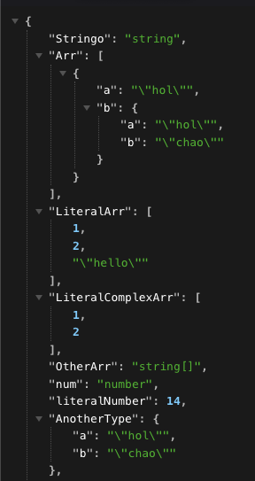

# Type-Tree

> Takes the root path of your ts project and serves `json` file with extracted types and interfaces from ts files. It facilitates the visualization of nested types, specially when types are imported from different files. You can see it as a type tree creator for your types.

## How to use it:



This project was created using [Bun](https://bun.sh), and [ts-morph](https://ts-morph.com/).
Follow the next steps to run it locally.

### Install dependencies:

Note: You can use `npx bun` if you do not want to install bun.

```bash
bun install
// or npx bun install
```

### Run

```bash
bun run start --root PATH_TO_THE_ROOT_OF_YOUR_TS_PROJECT
// or npx bun run start --root PATH_TO_THE_ROOT_OF_YOUR_TS_PROJECT
```

Where `--root` should have the root path to your project. This necessary to find the `tsconfig.json` file, required for the program to properly work. This will default `./` if not provided.

### View type tree

Go to http://localhost:3001 to see the root of your project directory, then navigate to the ts file that you want to extract types from. It will create a type tree in json format.

Note: You can also set a different `PORT` env variable if 3001 is not available.

It is required to use a json viewer browser extension for better visualization. For example, [JSON Formatter](https://chromewebstore.google.com/detail/json-formatter/bcjindcccaagfpapjjmafapmmgkkhgoa?hl=en) works well for me.

### Contributions

PRs are always welcome. Please consider adding and running tests for better development experience.

### Test

```bash
bun run test
```
