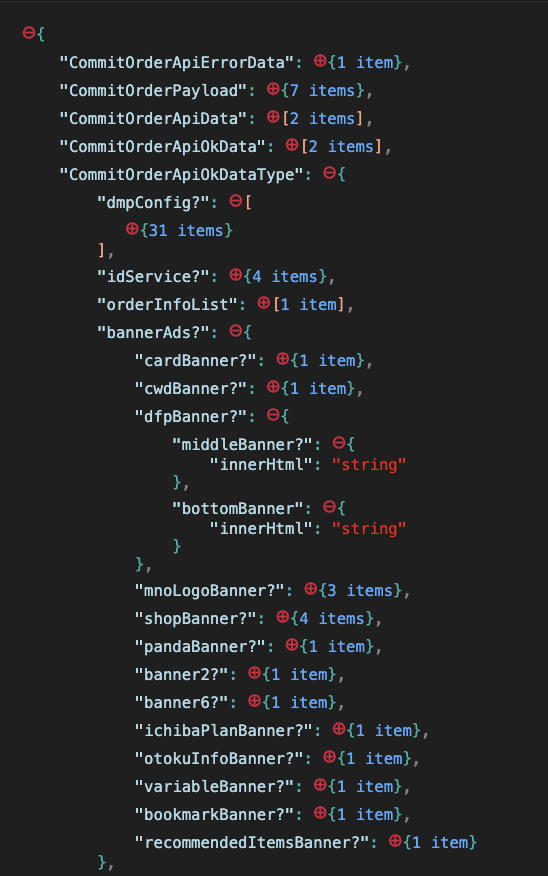
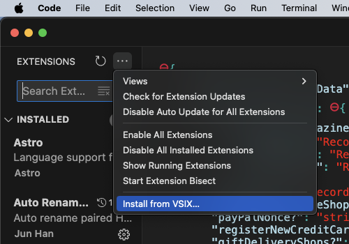

# Type Tree

Typescript type tree visualization in Vscode.

## Features

Instead of navigating in the ocean of types declarations. Have them all in tree like json. You can open and close nodes of the trees once you are done.

This extension was created with [ts-morph](https://ts-morph.com/) and [renderjson](https://caldwell.github.io/renderjson/).
Please give them a star.

## Requirements

Vscode

## How to install

1. Download/clone this repository.
2. Open extensions in Vscode and click install from VSIX.
3. Add the `.vsix` file that you will find in this repository.

## How to use

1. Open a Typescript project. Ensure you have a tsconfig.ts file in the root of your project.
2. Open your target ts file you want to create a type tree from.
3. Use Command + Shift + P in Mac (Ctrl + Shift + P in Windows/Linux). Write `Type Tree` and click enter.
4. You should see two messages saying tsconfig and your target file were added. A Vscode browser screen should open with the results. You can open/close the nodes for better visualization.
